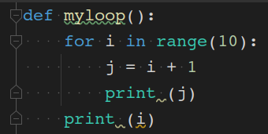
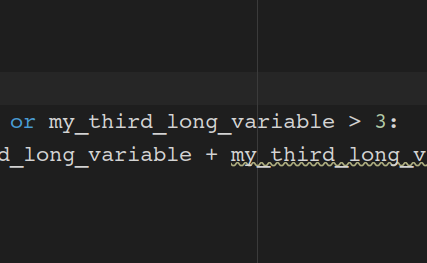

# Writing Readable Code: Coding Style Guides

[Part 1 - Introduction](wrc_python_style_guides_1_intro.md)

[Part 2 - Pep8 Specifics](#pep8)

[Part 3 - Pep8 Exercise](wrc_python_style_guides_3_pep8_exercise.md)

[Part 4 - Automatic Checking](wrc_python_style_guides_4_automatic_checking.md)

## PEP8

In Python, although we do have a choice of style guides available, the [PEP8](https://www.python.org/dev/peps/pep-0008/) style guide is most commonly used.

PEP here stands for Python Enhancement Proposals; PEPs are design documents for the Python community, typically  specifications or conventions for how to do something in Python, a description of a new feature in Python, etc.

A full list of style guidelines for pep8 is available from the [PEP8 website](https://www.python.org/dev/peps/pep-0008/), here  I will just highlight a few.

### Pep8 Specifics

#### Indentation

As you may know, Python uses indentation as a way of grouping statements that belong to a particular block of code.


This means that:

[Code snippet 4](../../code_snippets/wrc_indents_ex_1.py)
```python
for i in range(5):
    j = i + 1
    print (j)
print (i)
```
Output:

    1
    2
    3
    4
    5
    4

is different to:

[Code snippet 5](../../code_snippets/wrc_indents_ex_2.py)

```python
for i in range(5):
    j = i + 1
    print (j)
    print (i)
```

Output:

    1
    0
    2
    1
    3
    2
    4
    3
    5
    4

And different to:

[Code snippet 6](../../code_snippets/wrc_indents_ex_3.py)

```python
for i in range(5):
    j = i + 1
print (j)
print (i)
```

Output:

    5
    4
This is essential in Python but there are different indentation styles.


#### 🗳️ Class Poll

Do you indent using spaces or tabs?


Spaces are the recommended indentation method in Python. 
The guideline is to use 4 spaces per indentation level - so 4 spaces on level one, 8 spaces on level 2 and so on.

[Code snippet 7](../../code_snippets/wrc_indents_correct.py)

```python
def myloop():
    for i in range(10):
        j = i + 1
        print (j)
    print (i)
```


Many people prefer the use of tabs rather than spaces to indent the code for many
reasons (e.g. additional typing, easy to introduce an error by
missing a single space character, etc.) and do not follow this
guideline.

Whether you decide to follow this guideline or not,
be consistent and follow the style already used in the project.

⚠️ Python 3 disallows mixing the use of tabs and spaces for indentation.

PyCharm and other Python editing tools have built-in support for 
converting tab indentation to spaces  in order to
conform to PEP8. So, you can type a tab character and PyCharm will
automatically convert it to 4 spaces.

You can also tell many editors to show non-printable characters
if you are ever unsure what character exactly is being used

e.g. in Pycharm by selecting `View`>`Active Editor`>`Show whitespace`.





#### Maximum Line Length
All lines should be up to 80 characters long, for lines containing comments or docstrings the line length limit should be 73.

You can configure your IDE to indicate the maximum line length




Long lines of code can be broken over multiple lines by wrapping expressions in brackets (preferred method), or using a backslash (`\`) at the end of the line to indicate line continuation (slightly less preferred method).


#### 💻 Individual activity

Use brackets `()` to wrap the following long lines of code.

[Code snippet 8](../../code_snippets/wrc_long_code_line.py)

```python
my_first_long_variable = 5
my_second_long_variable = 3
my_third_long_variable = 1

if my_first_long_variable > 1 or my_second_long_variable > 2 or my_third_long_variable > 3:
    my_new_long_variable = my_first_long_variable + my_second_long_variable + my_third_long_variable
```

<details>
<summary>
Example solution:
</summary>

[Code snippet 9](../../code_snippets/wrc_long_code_line_brackets.py)

```python
my_first_long_variable = 5
my_second_long_variable = 3
my_third_long_variable = 1

if (my_first_long_variable > 1
        or my_second_long_variable > 2
        or my_third_long_variable > 3):
    my_new_long_variable = (my_first_long_variable
                            + my_second_long_variable
                            + my_third_long_variable)


```
</details>

You can also use a backslash \ to split code over multiple lines (but it is best to avoid this if you can).

<details>
<summary>
Example solution:
</summary>

[Code snippet 10](../../code_snippets/wrc_long_code_line_backslash.py)

```python
my_first_long_variable = 5
my_second_long_variable = 3
my_third_long_variable = 1

if my_first_long_variable > 1 \
        or my_second_long_variable > 2 \
        or my_third_long_variable > 3):
    my_new_long_variable = my_first_long_variable \
                           + my_second_long_variable \
                           + my_third_long_variable
```
</details>


To separate a string over more than one line, you can enclose it in triple quotes - `"""string"""`.

If you don't want to include the line break in the string, use a backslash \ inside quotes (single or triple quotes)

[Code snippet 11](../../code_snippets/wrc_triple_quoted_string.py)

```python
print ("""1. This string is broken up over
        more than one line""")

print ("2. This string is all on \
the same line")
```

Output:

    1. This code is broken up over
            more than one line
    2. This code is all on the same line


#### Blank Lines

Function and class definitions should be surrounded with two blank lines.

Method definitions inside a class should be surrounded by single blank lines.

You can use single blank lines inside functions to indicate logical sections.

This would be a pep8 compliant layout:

[Code snippet 12](../../code_snippets/wrc_layout.py)
```python
def function1(x, y):
    print("This is function 1") 
    print("Function 1 is running")

    x += 1
    y += 1
    z = x + y
    return (z)


def function2(y):
    print("Function 2 is running")
    y += 5
    return(y)


````
        

#### Whitespace in Expressions and Statements

The pep8 white space guidelines are fairly similar to how punctuation is used when writing text.

* There shouldn't be spaces between brackets `()` and the text inside the brackets.

#### 🗳️ Class Poll

Which of the following sentences is correctly punctuated

1. `Style guides (  such as pep8) are important.`

2. `Style guides (  such as pep8  ) are important.`

3. `Style guides (such as pep8  ) are important.`

4. `Style guides (such as pep8) are important.`

Which of the following Python statements is correctly formatted?

1. 
```python
y = ( x / 2 ) + 1
```

2
```python
y = ( x / 2) + 1
```

3. 
```python
y = (x / 2 ) + 1
```

4. 
```python
y = (x / 2) + 1
```

* Commas `,` and colons `:` should have no spaces before, but one space after

1. `Style guides: annoying, but useful`

2. `Style guides : annoying , but useful`

3. `Style guides :annoying ,but useful`


1. 

```python
def myfun(x, y):
    print(y, x)
```

2.
```python
def myfun(x , y) :
    print(y , x)
```

3. 
```python
def myfun(x ,y) :
    print (y ,x)
```

Other operators should have a space on either side (unless at the end of a line)

This snippet has pep8 compliant whitespace

[Code snippet 13](../../code_snippets/wrc_whitespace.py)
```python
x = 2
y = x + 1
if y == 2:
    print(y / 2)
if x < 3:
    print(x / 3)
```

#### Trailing whitespace

There shouldn't be whitespace (spaces or tabs) on the end of a line or on blank lines

In many editors you can make whitespace visible to check this
e.g. in Pycharm by selecting `View`>`Active Editor`>`Show whitespace`.

#### Naming conventions
The main thing to think about when naming a variable or a function is whether the name is useful to you. Many of the example functions in this tutorial have terrible names, it is better to use a descriptive name than `x`, `y`, `my_var`, `function1` etc.

There are various conventions used for naming variables and functions.
* `lowercase`
* `lower_case_with_underscores`
* `UPPERCASE`
* `UPPER_CASE_WITH_UNDERSCORES`
* `CapitalisedWords`
* `mixedCase`
* `Capitalised_Words_With_Underscores`

Under the pep8 guidelines all **function** and **variable** names should use the `lower_case_with_underscores` convention. 

**Class** names should use the `CapitalisedWords` convention.

**Module** names should use the `lowercase` convention.

#### Imports
All imports should be at the top of the file, so they are easy to find.

Wildcard imports e.g.

```python
from matplotlib import *
```

should be avoided because it's no longer clear which package provided each function.


There are many other pep8 recommendations, however it's worth remembering that complying with any of them is better than complying with none.

None of these are strict rules, but following them where possible will improve the readability and resuability of your code.

[Next Lesson: Pep8 Exercise](wrc_python_style_guides_3_pep8_exercise.md)

*Lesson adapted from: https://github.com/carpentries-incubator/python-intermediate-development/blob/gh-pages/_episodes/15-coding-conventions.md*